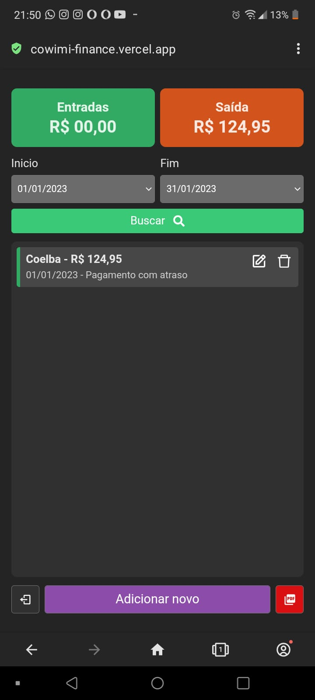
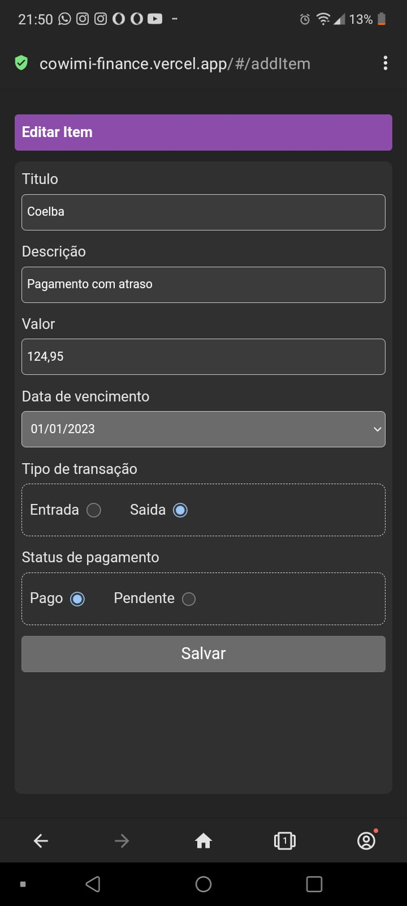
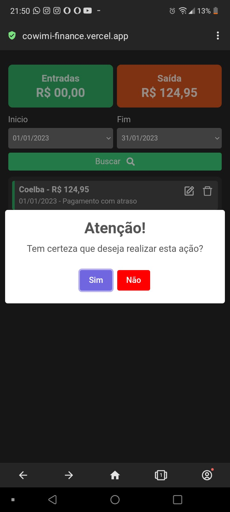

<h1>Cowimi Finance</h1>

Aplicação financeira simples para registro de movimentações financeiras

##

🔴 A pedido de uma colega minha criei esta aplicação, que tem por finalizade registrar as movimentações financeiras das empresas que ela gerencia e emitir um relatório em PDF para a contabilidade.

♦️ Inicialmente usei VITE e para desenvolver a aplicação em React, mas tive problemas quando precisei usar o 'React PDF redenderer' então resolvi mudar para o CRA (Create React APP)

A página foi criada no conceito Mobile First (Com foco primeiramente no mobile), mas é responsiva para Desktop e tablet também.

Caso tenha interesse em testar o projeto em sua maquina local, baixe o repositorio, depois use "npm install" ou "yarn" para baixar e instalar as dependencias;

##

<a href="https://cowimi-finance.vercel.app/" target="_blank"><strong>Link da página:</strong>[ https://linksenai.vercel.app/](https://cowimi-finance.vercel.app/)</a>

##

	<h1>Screenshots</h1>
	

		
		
	

	

		
		
	

